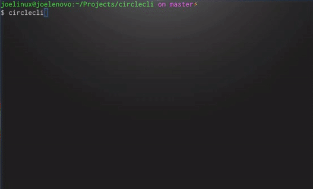

# CircleCLI    
Unofficial CircleCI cross-platform CLI tool, written in Python.

**_Note: This project is currently in beta. There will be bugs._**



## Features
* Cross-platform (Linux, BSD, OSX, Windows)
* Easy, natural interaction with CircleCI's REST API
* Easy-to-read output (you can still get original output)
* Add multiple environment variables to your project at once (the API can't)
* View current CircleCI site and component status
* Validate your circle.yml files (and a pre-commit hook to do it automatically)
* Read token from environment (great for scripting)
* **Now supporting CircleCI Enterprise!**

See the [Examples](#examples) section for common types of usage.

## Installation
#### Using package management
```
pip install circlecli
```
#### Manually
```
python setup.py install
```

## Configuration
CircleCLI requires an API token from your CircleCI [Account Settings](https://circleci.com/account/api) page.
You may set this token as an environment variable named `CIRCLE_TOKEN` (good for scripting), or CircleCLI will interactively ask you for this token on first run if no configuration file is present.
If you let CircleCLI prompt you for info, then it will create a configuration file named `.circlecli.ini` in your user's home directory that looks like this:
```
[circlecli]
token = XXXXX
default_username = XXXXX
baseurl = XXXXX
```
You can always edit your own values in this configuration file.

## Usage
```
usage: circlecli [--help] [--project PROJECT] [--username USERNAME]
                 [--api-baseurl BASEURL] [--build-num BUILD_NUM] [--config]
                 [--quiet] [--set ENVVARS] [--filter FILTERS] [--verbose]
                 [action] [help]

Execute CircleCI REST API commands from the CLI.

positional arguments:
  action                An action to perform (see below)
  help                  Get help on a particular action

optional arguments:
  --help, -h            Display this help text
  --project PROJECT, -p PROJECT
                        The target project name
  --username USERNAME, -u USERNAME
                        The username of the project/repo owner
  --api-baseurl BASEURL, -a BASEURL
                        The target CircleCI API base URL
  --build-num BUILD_NUM, -b BUILD_NUM
                        The target build number
  --config, -c          Only print saved configuration values
  --quiet, -q           Suppress output
  --set ENVVARS, -s ENVVARS
                        Set a variable (used with 'env' action)
  --filter FILTERS, -f FILTERS
                        Match only response objects matching filter
  --verbose, -v         Return original full output from CircleCI

available actions:
  me            Provide information about the signed in user.
  projects      List of all the projects you're following on CircleCI.
  builds        Last 30 build summaries for the account (or for a project).
  artifacts     List the artifacts produced by a given build.
  retry         Retry a given build.
  cancel        Cancel a given build.
  clear-cache   Clear the cache for a project.
  env           List or add environment variables for a project.
  check         Ensure a circle.yml file is valid according to CircleCI docs.
  status        Check CircleCI site status (http://status.circleci.com).
  <cmd> help    Display help text for a particular action
```
CircleCLI by default displays formatted, concise data for each action.
To display the original response from CircleCI, simply add `-v` to your command.

## Examples
#### Print information about your account
```
me@foobox:~$ circlecli me
Name: Barack Obama
Emails: president@whitehouse.gov
Sign-In Count: 36
Heroku API Key: None
Containers: 1
Parallelism: 1
Username: TheRealBarack
Admin: False
Projects: https://github.com/whitehouse/constitution, https://github.com/whitehouse/education, https://github.com/whitehouse/us_web_design_standards
```
#### Print detected configuration and exit
```
me@foobox:~$ circlecli config
token = THISISNOTAREALTOKEN
default_username =
```
#### Validate a circle.yml file
```
me@foobox:~$ circlecli check /home/foo/projects/bar/circle.yml
'branch' or 'tag' required in 'deployment.staging'
```
#### Check status of CircleCI components (from [http://status.circleci.com](http://status.circleci.com))
```
me@foobox:~$ circlecli status -v
All Systems Operational

CircleCI                      : Operational
GitHub                        : Operational
Heroku                        : Operational
AWS                           : Operational
Pusher Pusher REST API        : Operational
Pusher WebSocket client API   : Operational
OS X Builds                   : Operational
Test Result Processing        : Operational
Ubuntu 14.04 Builds           : Operational
```
#### List projects you follow
```
me@foobox:~$ circlecli projects
whitehouse/constitution
whitehouse/education
whitehouse/us_web_design_standards
```
#### Filter only projects that build on OSX
```
me@foobox:~$ circlecli projects -f feature_flags.osx=true
whitehouse/education
```
#### List builds for the account
```
me@foobox:~$ circlecli builds
...
Build# : 11
Author : Barack Obama <president@whitehouse.gov>
Branch : master
Queued : Fri, Jul 08, 2016 08:09PM EDT
Trigger: github
URL    : https://circleci.com/gh/whitehouse/us_web_design_standards/11
Result : canceled

Build# : 12
Author : None
Tag    : v1.1.1
Queued : Fri, Jul 08, 2016 08:42PM EDT
Trigger: github
URL    : https://circleci.com/gh/whitehouse/us_web_design_standards/12
Result : success
```
#### Filter builds by a specific user
```
me@foobox.com:~$ circlecli builds -f user.login=TheRealBarack
Build# : 11
Author : Barack Obama <president@whitehouse.gov>
Branch : master
Queued : Fri, Jul 08, 2016 08:09PM EDT
Trigger: github
URL    : https://circleci.com/gh/whitehouse/us_web_design_standards/11
Result : canceled
```
#### View a specific build's details
```
me@foobox:~$ circlecli builds -u foo_user -p foo_project -b 12
Build# : 12
Author : None
Tag    : v1.1.1
Queued : Fri, Jul 08, 2016 08:42PM EDT
Trigger: github
URL    : https://circleci.com/gh/whitehouse/us_web_design_standards/12
Result : success
```
#### Retry a build
```
me@foobox:~$ circlecli retry -u foo_user -p foo_project -b 12
Build# : 13
Author : Barack Obama <president@whitehouse.gov>
Branch : master
Queued : Sun, Jul 10, 2016 12:17AM EDT
Trigger: retry
URL    : https://circleci.com/gh/whitehouse/us_web_design_standards/13
Result : None
```
#### Cancel a build (using the default username)
```
me@foobox:~$ circlecli cancel -p foo_project -b 12
Build# : 13
Author : Barack Obama <president@whitehouse.gov>
Branch : master
Queued : Sun, Jul 10, 2016 12:17AM EDT
Trigger: retry
URL    : https://circleci.com/gh/whitehouse/us_web_design_standards/13
Result : canceled
```
#### Clear a project's cache
```
me@foobox:~$ circlecli clear-cache -p foo_project
status: build dependency caches deleted
```
#### List a project's environment variables (using the default username)
```
me@foobox:~$ circlecli env -p foo_project
DEPLOY_ENV: xxxxg
```
#### Set an environment variable
```
me@foobox:~$ circlecli env -u foo_user -p foo_project -s TEST_ENV=stage
TEST_ENV: xxxxge
```
#### Set multiple environment variables (using the default username)
```
me@foobox:~$ circlecli env -p foo_project -s FOO=BAR -s BAZ=QUX
FOO: xxxxR
BAZ: xxxxX
```
